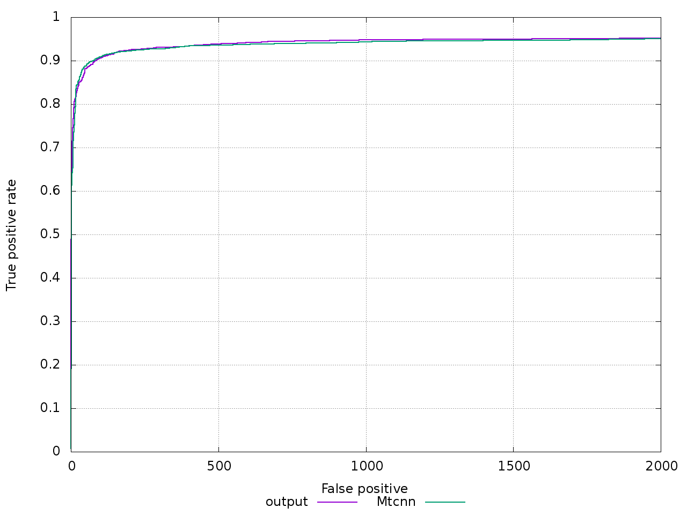
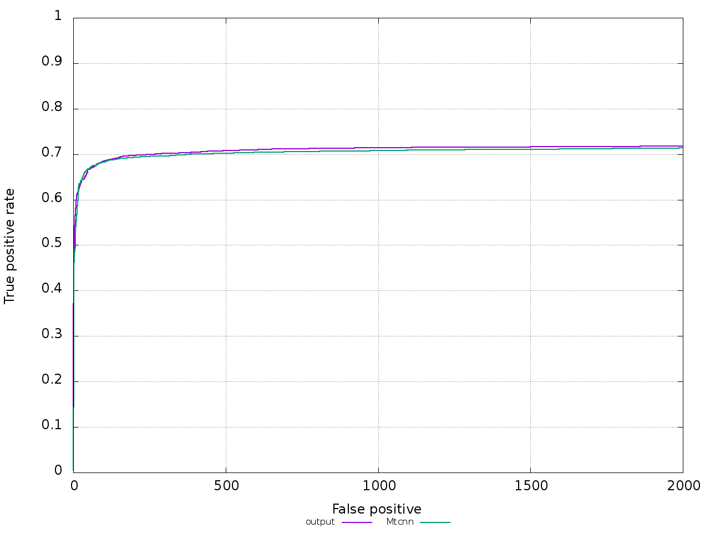
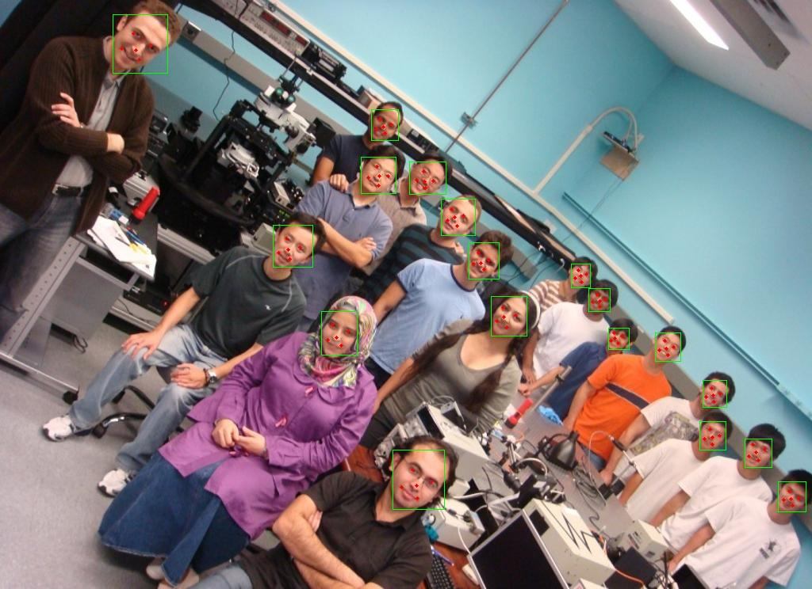

# mtcnn_pytorch
完美复现!

## 一、算法介绍
MTCNN，Multi-task convolutional neural network（多任务卷积神经网络），将人脸区域检测与人脸关键点检测放在了一起，它的主题框架类似于cascade。总体可分为P-Net、R-Net、和O-Net三层网络结构。

## 二、实现结果（完美复现，不是接近！）
2.1. 准确率  
     

2.2. 速度  
|mtcnn| hardware | software | image_size | min_size | speed |
|-----|------|------|-----|----|----|
|zhang's| i7-9700K|	vs2017-opencv-dnn|640x480|	20|	35ms|
|samylee| i7-9700K|	vs2017-opencv-dnn|640x480|	20|	32ms|

2.3. 优势  
2.3.1. 大多数复现mtcnn代码并不能完美复现mtcnn的速度，因为他们pnet网络产生了大量负样本，导致整体算法速度减慢，虽然能获得更大的recall，但摒弃了mtcnn算法设计初衷。  
2.3.2. 大多数复现mtcnn代码并不能完美复现mtcnn的精度，其ROC曲线并不能重合或稍高。  
2.3.3. 大多数复现mtcnn代码编写复杂，逻辑冗长，无法一目了然。  
2.3.4. 提供pytorch转caffe工具和c++实现工程，工程部署不在话下。  

2.4. 效果展示  
   
   
  

## 三、实现要求
3.1. 系统及硬件要求  
ubuntu16.04, nvidia-1080 或者更高，  
3.2. 软件要求   
anaconda（强烈建议），pycharm（强烈建议）  
3.3. 算法依赖  
python==3.6  
pytorch-gpu==1.4  
opencv-python==4.5.4  
pickle  

## 四、实现步骤
4.1. pnet实现  
4.1.1. 进入'prepare_data/12net_data'下依次运行'gen_12net_data.py'和'gen_12net_imdb.py'，用以生成pnet数据结构。  
4.1.2. 进入'train', 新建'pnet'文件夹，运行'train_pnet.py'  
4.2. rnet实现  
4.2.1. 进入'prepare_data/24net_data'下依次运行'gen_24net_data.py', 'gen_24net_data_append.py', 'gen_24net_landmark_data.py'和'gen_24net_imdb.py'，用以生成rnet数据结构。  
4.2.2. 进入'train', 新建'rnet'文件夹， 运行'train_rnet.py'  
4.3. onet实现  
4.3.1. 进入'prepare_data/48net_data'下依次运行'gen_48net_data.py', 'gen_48net_data_append.py', 'gen_48net_landmark_data.py'和'gen_48net_imdb.py'，用以生成rnet数据结构。  
4.2.2. 进入'train', 新建'onet'文件夹， 运行'train_onet.py'  

## 五、测试步骤
5.1. pnet测试  
进入'test'文件夹，运行'test_pnet.py'  
5.2. rnet测试  
进入'test'文件夹，运行'test_rnet.py'  
5.3. onet测试  
进入'test'文件夹，运行'test_onet.py'  

## 六、验证步骤
6.1. 进入'validate'文件夹下，新建'output'文件夹，运行'gen_fddb_results.py'即可。  
6.2. 获得ROC曲线方式网上博客很多，这里就不介绍了。  

## 七. 实现细节
7.1. 关于pnet  
7.2. 关于rnet  
7.3. 关于onet  
7.4. imdb数据格式  
7.5. 数据增强  
7.6. loss设计  
7.7. wider数据调整  
7.8. celebA数据调整  

## 八. 模型转换和部署
8.1. caffe-python3  
新建anaconda环境工程，强烈建议使用python3.5，因为libboost-python3.5直接可以通过apt-get安装，并不需要重新编译boost库  
8.2. pnet转换  
运行pnet2caffe.py  
8.3. rnet转换  
运行rnet2caffe.py  
8.4. onet转换  
运行onet2caffe.py  
8.5. 部署  
将caffemodel放入工程目录下，使用vs2015/vs2017编译c++测试工程即可  

## 九、代码发现（499RMB，非诚勿扰）
请加唯一QQ2258205918（名称samylee）！  
或唯一VX：samylee_csdn  
